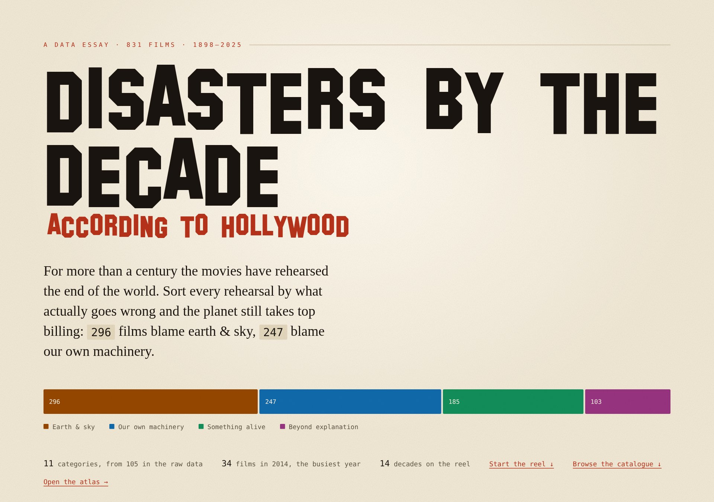
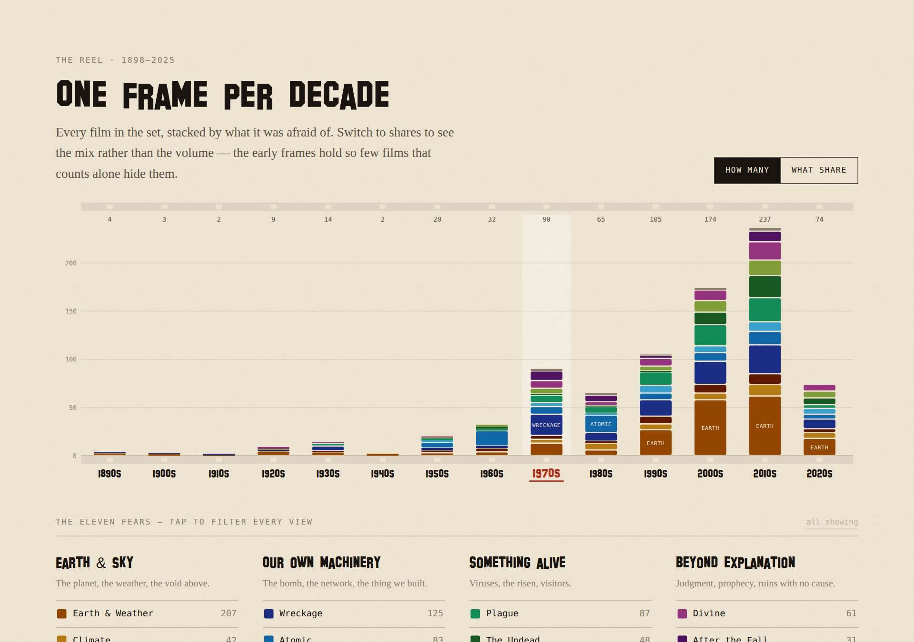
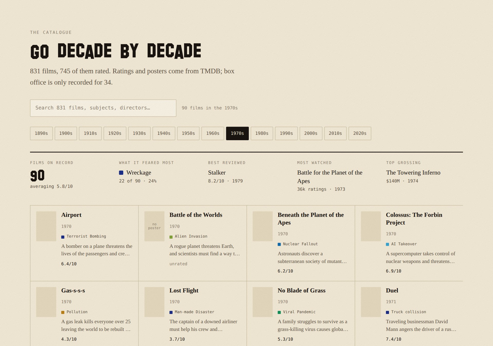
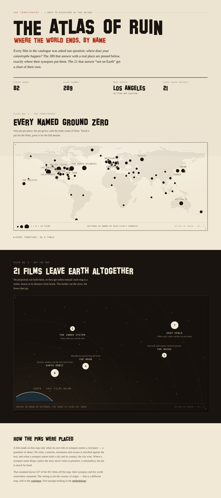
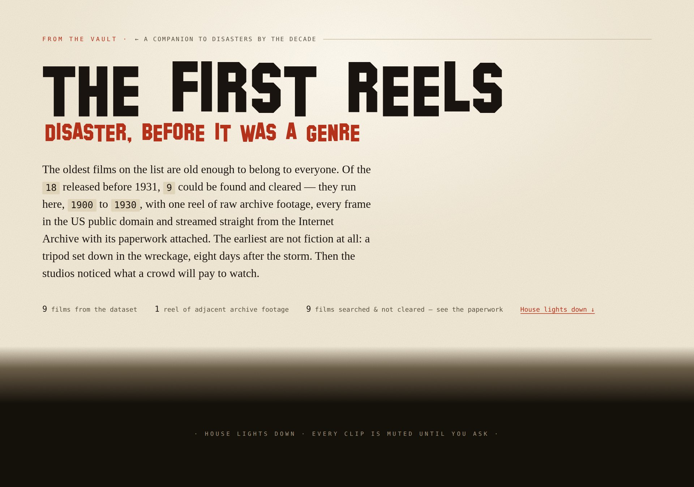
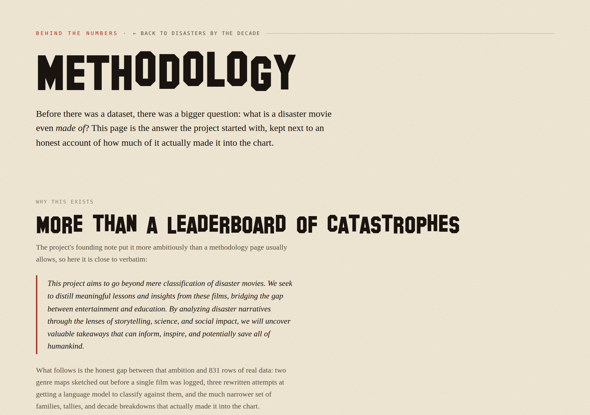

# Disasters by the Decade

**A data essay on 831 disaster movies, 1898–2025 — sorted by what Hollywood was actually afraid of, decade by decade.**

**[crisescinema.storytimemaps.com →](https://crisescinema.storytimemaps.com)**

For more than a century the movies have rehearsed the end of the world. This project takes every disaster film it could find — earthquakes to alien invasions, nuclear fallout to zombie outbreaks — sorts each one by its actual cause instead of its studio-assigned genre, and reads the resulting shape as a rough seismograph of the shared psyche: which fears peaked, which decade got the darkest, and when the machines stopped letting anyone escape.



## What's on the site

The site is a single long-form essay on the home page, with three companion sections that branch off it.

### The essay — decade chart, filters, and the film catalogue

The home page opens with the headline split (296 films blame earth & sky, 247 blame our own machinery, and so on), then a stacked bar chart — one frame per decade — that the reader can filter by any of eleven fear categories. Below it: eight short, data-backed observations ("the bomb was the only story," "then the ceiling fell in"), a plot-language breakdown comparing survival language to annihilation language film by film, and a searchable, poster-backed catalogue of all 831 films, browsable decade by decade.





### [The Atlas of Ruin](https://crisescinema.storytimemaps.com/atlas) — where the world ends, by name

Every film was asked one question: *where does your catastrophe happen?* The 289 that name a real place are pinned to a retro dotted-map, sized by how many films struck that spot. The 21 that leave Earth altogether get a second plate — concentric orbits by distance from home, from the inner system out to deep space.



### [The First Reels](https://crisescinema.storytimemaps.com/reel) — disaster, before it was a genre

Of the 18 films in the dataset released before 1931 — old enough to be US public domain by age — nine could be found and cleared for streaming, straight from the Internet Archive. Every clip had to pass four tests (release year, corroborating item date, no trailer-dump rips, a playable file) before it made the reel; the nine that didn't clear are listed too, with the reason why.



### [Methodology](https://crisescinema.storytimemaps.com/methodology) — how the categories were made

The source data tagged these films with 105 different disaster types, 49 main categories, and 191 subcategories — much of it inconsistent, some of it mangled by a bad comma-split. This page shows the two genre maps sketched out before a single film was logged, the three rewritten classification passes that followed, and the honest gap between that ambition and the eleven families that actually shipped in the chart. The full matching logic — [`scripts/taxonomy.mjs`](scripts/taxonomy.mjs) — is public.



## How it's built

This is a [Next.js 14](https://nextjs.org) (App Router) site written in TypeScript, styled with hand-written CSS rather than a component library — the retro-editorial look (Geist type, film-strip motifs, sprocket-hole chart axes) is bespoke to this project.

- **Data pipeline, not a database.** `scripts/build-data.mjs` and `scripts/build-atlas.mjs` turn the raw sources in `public/` (a ~800-film JSON export, plus a smaller box-office CSV) into two build artefacts: `src/data/summary.json` — decade and family aggregates the server renders as static HTML with no client fetch — and `public/data/films.json`, a slim list the interactive catalogue fetches at runtime. `npm run dev` and `npm run build` both regenerate this data before touching Next.
- **Classification.** `scripts/taxonomy.mjs` collapses the messy raw categories into eleven disaster "families" under four higher-level groups, through a three-tier matching pass: unambiguous named hazards first, then specific hand-written signals, then generic labels only as a last resort. Every regex is in that file, in the order it runs, for exactly this reason.
- **Charts are hand-rolled**, not a charting library — the stacked decade bars, the plot-language bars, and the Atlas of Ruin's map and orbital plate are all custom SVG/DOM components (`src/app/components/`, `src/app/atlas/AtlasView.tsx`) built around the site's own visual language rather than a generic chart kit.
- **Ratings, posters, and plot summaries** come from [TMDB](https://www.themoviedb.org/). Box office is recorded for only a fraction of the catalogue and is shown as such, not backfilled.
- **The reel** streams directly from the [Internet Archive](https://archive.org), with each clip's clearance basis recorded in `src/data/reel.json` and displayed on `/reel` itself.

## Running it locally

```bash
npm install
npm run dev
```

Open [http://localhost:3000](http://localhost:3000). `npm run dev` (and `npm run build`) run the data pipeline first, so the chart and catalogue reflect whatever is currently in `public/`.

Other scripts:

```bash
npm run build:data   # regenerate src/data/summary.json + public/data/films.json only
npm run build:reel   # rebuild src/data/reel.json (the /reel manifest)
npm run lint          # next lint
npm run lint-build    # lint, then build
```

## Project structure

```
src/app/
  page.tsx              home page (hero + decade chart + explorer + colophon)
  atlas/                 /atlas — the world map and off-world orbital chart
  reel/                   /reel — the public-domain first reels
  methodology/            /methodology — the taxonomy and classification write-up
  catalogue/               /catalogue — plain, script-free film index
  components/            Hero, DecadeChart, Explorer, FearIndex, CategoryRail, etc.
scripts/
  build-data.mjs        raw data -> summary.json + films.json
  build-atlas.mjs       raw data -> atlas.json (place pins + off-world realms)
  build-reel.mjs         reel manifest -> reel.json
  taxonomy.mjs           the classification logic (public, documented, linked from /methodology)
public/                  raw data sources (MasterMovies.json, movies.json, movie.csv, …)
```

## About

Disaster movies are a guilty pleasure turned scholarly pursuit. This project reads them less as a film buff's hobby and more as a timeline of cultural tremors — one mushroom cloud at a time. Full write-up, including the project's original founding ambition and how much of it made it into the data, on the [methodology page](https://crisescinema.storytimemaps.com/methodology).

Built by [Sam Frons](https://github.com/samfrons).
